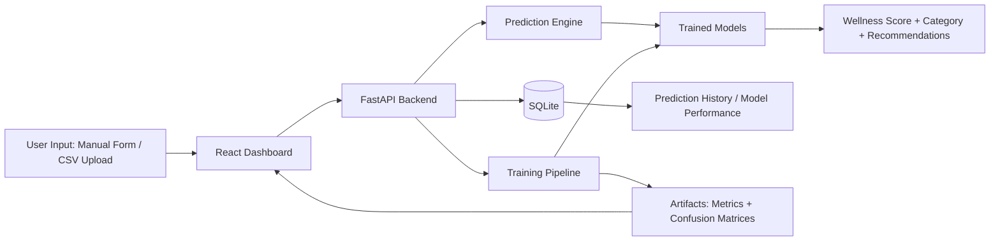

# Human Digital Twin for Personal Wellness Optimization

Production-style mini project that simulates a person's wellness state using machine learning and visualizes insights in a modern interactive dashboard.

## Project Objective

The system predicts a user's wellness condition from health and lifestyle parameters and provides actionable recommendations.

Core capabilities:
- Manual health data entry
- CSV/Excel dataset upload and batch predictions
- ML model training pipeline
- Wellness prediction and category classification
- Interactive analytics dashboards
- Prediction history and export tools

## Tech Stack

### Machine Learning
- Python
- Pandas, NumPy
- Scikit-learn
- TensorFlow/Keras (optional but supported in code)
- Matplotlib, Seaborn

### Backend
- FastAPI
- SQLite

### Frontend
- React (Vite)
- TailwindCSS
- Framer Motion
- Recharts

## Input Parameters

- `age`
- `gender`
- `sleep_hours`
- `daily_steps`
- `heart_rate`
- `calories_burned`
- `stress_level`
- `water_intake`
- `exercise_minutes`

## Output

- `wellness_score` (0-100)
- `wellness_category` (`Poor`, `Average`, `Good`, `Excellent`)
- Personalized AI recommendations

## Project Structure

```text
human-digital-twin/
├── backend/
│   ├── main.py
│   ├── model_training.py
│   ├── prediction_engine.py
│   ├── data_processing.py
│   ├── database.py
│   ├── requirements.txt
│   └── artifacts/
├── models/
│   ├── logistic_regression.pkl
│   ├── random_forest.pkl
│   ├── preprocessor.pkl
│   └── lstm_model.h5 (generated when TensorFlow is installed)
├── dataset/
│   └── wellness_dataset.csv
├── frontend/
│   └── digital-twin-dashboard/
│       ├── src/
│       ├── package.json
│       └── ...
└── README.md
```

## Architecture Diagram



## Dataset

If dataset is missing, synthetic data is generated (`5000-10000` configurable, default `7000`).

Columns:
- `age`
- `gender`
- `sleep_hours`
- `daily_steps`
- `heart_rate`
- `calories_burned`
- `stress_level`
- `water_intake`
- `exercise_minutes`
- `wellness_score`

`wellness_score` is computed using a weighted formula that combines positive and negative wellness factors.

## Model Training

Implemented models:
1. Logistic Regression
2. Random Forest (`n_estimators=100`)
3. LSTM Neural Network (if TensorFlow is available)

Evaluation metrics:
- Accuracy
- Precision
- Recall
- F1 Score

Artifacts saved in `backend/artifacts/`:
- `model_metrics.json`
- confusion matrix images
- correlation heatmap
- wellness score distribution plot

Current sample run (`7000` synthetic rows in this environment):

| Model | Accuracy | Precision | Recall | F1 |
|---|---:|---:|---:|---:|
| Logistic Regression | 0.7750 | 0.7712 | 0.7750 | 0.7698 |
| Random Forest | 0.7914 | 0.7911 | 0.7914 | 0.7837 |
| LSTM | Not available | - | - | - |

## FastAPI Endpoints

- `POST /predict`  
  Predict wellness for one user input.

- `POST /upload-data`  
  Upload CSV/XLSX, run batch predictions, and return dataset insights.

- `POST /train-model`  
  Trigger training pipeline.

- `GET /model-performance`  
  Return model performance metrics.

- `GET /prediction-history`  
  Return previous prediction records.

## Dashboard Modes

1. Wellness Overview Dashboard
- Score card
- Digital twin status panel (green/yellow/red)
- AI recommendations
- Model comparison and prediction history

2. Analytics Dashboard
- Sleep vs Wellness
- Stress vs Wellness
- Daily Steps vs Wellness
- Heart rate trends

3. Dataset Insights Dashboard
- Uploaded dataset summary
- Category distribution
- Correlation snapshot
- Batch prediction preview

## Bonus Features Included

- Dark mode toggle
- Prediction history tracking (SQLite)
- Export prediction history (CSV)
- Download wellness report (text file)

## Setup and Run

### 1. Backend

```bash
cd human-digital-twin/backend
python -m venv .venv
# Windows
.venv\Scripts\activate
pip install -r requirements.txt
```

Run API:

```bash
uvicorn main:app --reload --port 8000
```

Train models manually:

```bash
python model_training.py --force-generate --records 7000 --lstm-epochs 15
```

### 2. Frontend

```bash
cd human-digital-twin/frontend/digital-twin-dashboard
npm install
npm run dev
```

Open: `http://localhost:5173`

## Screenshots / Generated Visuals

Use generated artifacts as report visuals:
- `backend/artifacts/logistic_confusion_matrix.png`
- `backend/artifacts/random_forest_confusion_matrix.png`
- `backend/artifacts/feature_correlation_heatmap.png`
- `backend/artifacts/wellness_score_distribution.png`

## Notes

- In this environment, TensorFlow may not be installed by default.  
  If unavailable, Logistic Regression and Random Forest still train and serve predictions; LSTM metrics are reported as unavailable until TensorFlow is installed.
